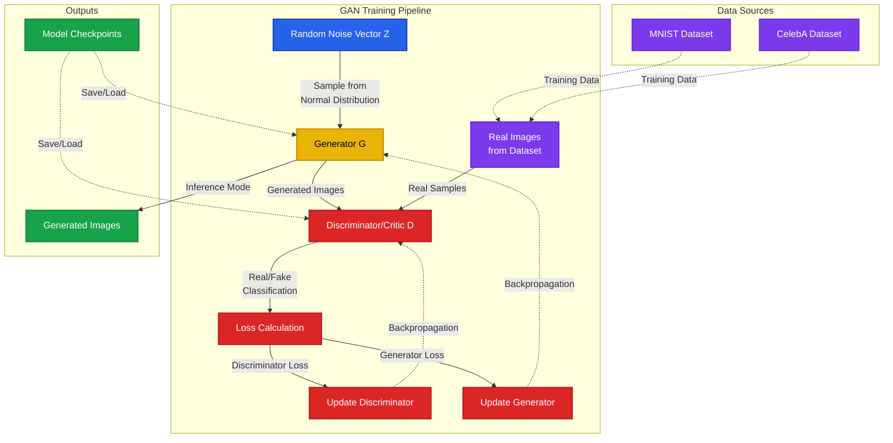
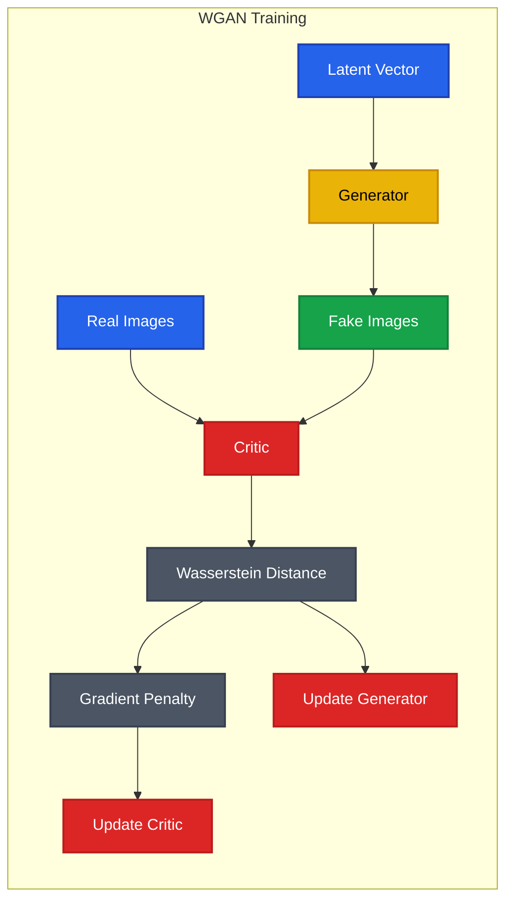

# Generative Adversarial Networks (GANs) Repository

A comprehensive collection of GAN implementations using PyTorch, featuring multiple architectures and training strategies for generating high-quality synthetic images.

## 📋 Table of Contents

- [Overview](#overview)
- [GAN Architectures](#gan-architectures)
- [Datasets](#datasets)
- [Project Structure](#project-structure)
- [Models](#models)
- [Requirements](#requirements)
- [Usage](#usage)
- [Trained Checkpoints](#trained-checkpoints)
- [Architecture Diagram](#architecture-diagram)
- [Technical Details](#technical-details)
- [Results](#results)

## 🔍 Overview

This repository contains implementations of various Generative Adversarial Network architectures built with PyTorch. GANs are deep learning models that consist of two neural networks - a Generator and a Discriminator - competing against each other to produce increasingly realistic synthetic data.

The project includes:
- **Basic GAN**: Fundamental GAN implementation with PyTorch
- **WGAN**: Wasserstein GAN with improved training stability
- **Stable WarpFusion**: Advanced image generation and manipulation

## 🏗️ GAN Architectures

### 1. Basic GAN (`basic_model_with_pytorch.ipynb`)
A foundational implementation of Generative Adversarial Networks using PyTorch. This notebook demonstrates:
- Core GAN architecture with Generator and Discriminator networks
- Standard adversarial training loop
- Image generation and visualization
- Loss tracking and model evaluation

### 2. Wasserstein GAN (`WGAN.ipynb`)
An advanced implementation featuring the Wasserstein GAN architecture, which provides:
- Improved training stability through Wasserstein distance
- Gradient penalty for enforcing Lipschitz constraint
- Better convergence properties
- Enhanced image quality

### 3. Stable WarpFusion (`stable_warpfusion.ipynb`)
A sophisticated approach to image generation and manipulation using stable diffusion techniques combined with warp-based transformations.

## 📊 Datasets

The project utilizes multiple datasets for training:

### MNIST
- Handwritten digit generation
- 28x28 grayscale images
- 60,000 training samples

### CelebA (Celebrity Faces Attributes)
- Face generation tasks
- High-resolution celebrity images
- Located in `data/celaba/img_align_celeba/`
- Aligned and cropped face images

## 📁 Project Structure

```
Gan/
├── basic_model_with_pytorch.ipynb    # Basic GAN implementation
├── WGAN.ipynb                         # Wasserstein GAN implementation
├── stable_warpfusion.ipynb           # Stable WarpFusion model
├── data/                              # Dataset directory
│   ├── celaba/                        # CelebA dataset
│   │   └── img_align_celeba/         # Aligned celebrity faces
│   └── MNIST/                         # MNIST dataset
│       └── raw/                       # Raw MNIST data
├── G-latest.pkl                       # Latest Generator checkpoint
├── G-lastest.pkl                      # Generator checkpoint (alternate)
├── G-test.pkl                         # Test Generator checkpoint
├── C-latest.pkl                       # Latest Critic/Discriminator checkpoint
├── C-lastest.pkl                      # Critic checkpoint (alternate)
└── C-test.pkl                         # Test Critic checkpoint
```

## 🤖 Models

### Generator (G)
The Generator network creates synthetic images from random noise vectors (latent space):
- Transforms random noise into realistic images
- Progressively upsamples features through transposed convolutions
- Learns to mimic the distribution of real data

### Discriminator/Critic (C)
The Discriminator (or Critic in WGAN) evaluates the authenticity of images:
- Classifies images as real or generated
- Provides feedback to improve the Generator
- Uses convolutional layers for feature extraction

## 🔧 Requirements

```python
# Core Dependencies
torch>=1.9.0
torchvision>=0.10.0
numpy>=1.19.0
matplotlib>=3.3.0
pillow>=8.0.0
jupyter>=1.0.0

# Optional for visualization
tensorboard>=2.6.0
```

## 🚀 Usage

### Training a Basic GAN

1. Open the Jupyter notebook:
```bash
jupyter notebook basic_model_with_pytorch.ipynb
```

2. Execute the cells sequentially to:
   - Load and preprocess the dataset
   - Initialize Generator and Discriminator
   - Train the GAN
   - Generate and visualize results

### Training WGAN

1. Launch the WGAN notebook:
```bash
jupyter notebook WGAN.ipynb
```

2. Follow the notebook to:
   - Configure WGAN-specific hyperparameters
   - Train with Wasserstein loss
   - Monitor gradient penalty
   - Generate high-quality images

### Loading Pretrained Models

```python
import torch

# Load Generator
generator = torch.load('G-latest.pkl')
generator.eval()

# Load Discriminator/Critic
critic = torch.load('C-latest.pkl')
critic.eval()

# Generate images
import torch
noise = torch.randn(64, latent_dim, 1, 1)
with torch.no_grad():
    generated_images = generator(noise)
```

## 💾 Trained Checkpoints

The repository includes pre-trained model checkpoints:

| Checkpoint | Type | Size | Description |
|------------|------|------|-------------|
| `G-latest.pkl` | Generator | ~50.7 MB | Most recent Generator model |
| `C-latest.pkl` | Critic | ~8.0 MB | Most recent Critic/Discriminator |
| `G-test.pkl` | Generator | ~14.9 MB | Test/experimental Generator |
| `C-test.pkl` | Critic | ~2.7 MB | Test/experimental Critic |

## 🏛️ Architecture Diagram



### WGAN-Specific Architecture



## 🔬 Technical Details

### Training Strategies

#### Basic GAN
- **Loss Function**: Binary Cross-Entropy
- **Optimizer**: Adam optimizer
- **Learning Rate**: Typically 0.0002
- **Beta Values**: (0.5, 0.999)

#### WGAN
- **Loss Function**: Wasserstein Distance
- **Gradient Penalty**: Enforces 1-Lipschitz constraint
- **Critic Updates**: Multiple critic updates per generator update
- **Optimizer**: RMSprop or Adam

### Hyperparameters

```python
# Common Hyperparameters
LATENT_DIM = 100          # Dimension of noise vector
BATCH_SIZE = 64           # Training batch size
NUM_EPOCHS = 50           # Number of training epochs
LEARNING_RATE = 0.0002    # Learning rate for optimizers
BETA1 = 0.5               # Adam optimizer beta1
BETA2 = 0.999             # Adam optimizer beta2
```

## 📈 Results

The trained models are capable of generating:
- **MNIST**: High-quality handwritten digits
- **CelebA**: Realistic human faces with diverse features

> **Note**: Generated image samples and training progression visualizations are available within each Jupyter notebook.

## 🎯 Future Improvements

Potential areas for enhancement:
- [ ] Implement Progressive GAN for higher resolution images
- [ ] Add StyleGAN architecture
- [ ] Integrate conditional GAN (cGAN) capabilities
- [ ] Implement evaluation metrics (FID, IS)
- [ ] Add tensorboard logging for better monitoring
- [ ] Create inference scripts for batch generation
- [ ] Implement interpolation in latent space

## 📚 References

- [Generative Adversarial Networks (Goodfellow et al., 2014)](https://arxiv.org/abs/1406.2661)
- [Wasserstein GAN (Arjovsky et al., 2017)](https://arxiv.org/abs/1701.07875)
- [Improved Training of Wasserstein GANs (Gulrajani et al., 2017)](https://arxiv.org/abs/1704.00028)

## 📝 License

This project is available for educational and research purposes.

---

**Note**: Make sure to have sufficient computational resources (preferably a CUDA-capable GPU) for training GANs efficiently.
